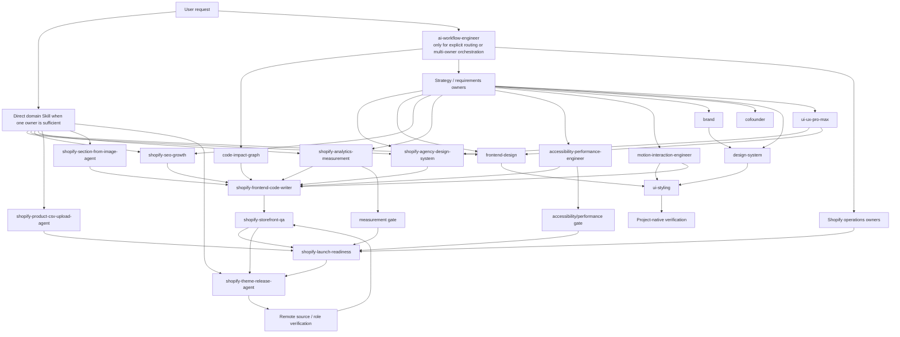

# WhaleLeap Codex Skill Architecture

## 1. Purpose

This document is the Phase 1 architecture map for the current WhaleLeap Codex Skill ecosystem under `skills/`.

It documents the current ownership model only. It does not redesign, merge, rename, delete, install, or change any Skill behavior. Local repository source is treated as the source of truth.

This map answers:

- Which Skills currently exist.
- Which domain each Skill belongs to.
- What each Skill primarily owns.
- What each Skill explicitly does not own.
- How upstream and downstream handoffs work.
- Which Skills are strategy, analysis, specification, implementation, verification, release, or utility owners.
- Where ownership ambiguity or capability gaps currently exist.

## 2. Architecture Principles

The repository currently supports these principles:

- One clear primary owner per responsibility.
- Prefer direct domain Skill activation when one owner is sufficient.
- `ai-workflow-engineer` is a meta-level router, not a universal wrapper.
- Strategy and specification owners should stop before implementation.
- Implementation owners should not redo upstream strategy.
- Verification should remain independent from implementation where practical.
- Release must remain explicit and separate from implementation.
- Avoid duplicate Skill execution.
- Prefer tools/MCP for external data and repository-derived evidence.
- Do not represent an uninstalled or future Skill as currently available.
- When a required owner does not exist, label a capability gap instead of stretching a nearby Skill.

## 3. Skill Domain Map

### ORCHESTRATION

- `ai-workflow-engineer`: meta-level Skill routing, sequencing, MCP/tool workflow planning, ownership boundaries, and duplication prevention.

### ENGINEERING QUALITY

- `code-impact-graph`: read-only repository relationship mapping, blast-radius prediction, risk boundaries, verification scope, and implementation handoff.

### SHOPIFY EXECUTION

- `shopify-frontend-code-writer`: Shopify Theme frontend implementation in Liquid, CSS, JavaScript, JSON, schema, locales, and assets.
- `shopify-section-from-image-agent`: confirmation-first reference-image-to-Shopify-section implementation workflow.

### SHOPIFY OPERATIONS

- `shopify-product-csv-upload-agent`: spreadsheet-driven product import planning, approved upload, and verification.
- `shopify-launch-readiness`: read-only cross-domain launch, relaunch, migration, and handoff readiness gate.

### GROWTH / SEO / ANALYTICS

- `shopify-seo-growth`: Shopify SEO, GEO, structured data, Search Console, Merchant Center, and organic growth requirements.
- `shopify-analytics-measurement`: event taxonomy, KPI definitions, GA4/Customer Events/Web Pixel measurement strategy, audits, validation, and data-quality gates.

### DESIGN

- `shopify-agency-design-system`: Shopify storefront design strategy, ecommerce CRO structure, premium visual direction, responsive requirements, and Theme Editor content-model requirements.
- `frontend-design`: non-Shopify visual and interaction design specifications for websites and web applications.
- `design-system`: token architecture, component specifications, CSS variable systems, Tailwind integration guidance, and brand-compliant slide-generation resources.
- `motion-interaction-engineer`: production motion strategy, timelines, technology selection, reduced-motion requirements, motion QA, and implementation handoff.
- `ui-ux-pro-max`: read-only UI/UX reference dataset lookup for design owners.

### IMPLEMENTATION

- `ui-styling`: React/Tailwind/shadcn/Radix UI implementation.

### QA / VERIFICATION

- `shopify-storefront-qa`: read-only Shopify browser regression QA, responsive visual QA, runtime evidence, Theme Editor lifecycle checks, and release gates.
- `accessibility-performance-engineer`: accessibility and performance audits, WCAG/Core Web Vitals evidence, requirements, verification criteria, and qualified gates.

### RELEASE / DELIVERY

- `shopify-theme-release-agent`: Shopify theme pull, compare, push, publish, rollback planning, remote verification, and release reporting.

### BUSINESS / STRATEGY

- `cofounder`: Shopify SaaS product strategy, merchant value, PMF validation, ROI judgment, and implementation-prompt handoff only after strategic review.

### CONTENT / BRAND

- `brand`: brand voice, visual identity, messaging frameworks, asset management, color/typography rules, and brand consistency workflows.
- `humanizer`: final copy rewriting and polish so content is natural, concrete, trustworthy, and conversion-aware.

## 4. Mermaid Architecture Diagram

This diagram shows common handoff paths. It intentionally does not make `ai-workflow-engineer` mandatory for every request; direct domain activation is valid when one Skill owns the job.

## 5. Ownership Matrix

| Skill | Domain | Role | Owns | Does Not Own | Upstream | Downstream | Status |
| --- | --- | --- | --- | --- | --- | --- | --- |
| `accessibility-performance-engineer` | QA / VERIFICATION | Analysis, Verification, Specification | WCAG 2.2 and performance audits, Core Web Vitals diagnosis, evidence gaps, requirements, audit gates | Code implementation, visual/CRO design, SEO, analytics instrumentation, release, legal certification | Direct request, `ai-workflow-engineer`, `shopify-launch-readiness`, `code-impact-graph` | `shopify-frontend-code-writer`, `shopify-storefront-qa`, `shopify-launch-readiness`, `shopify-theme-release-agent` | POTENTIAL OVERLAP |
| `ai-workflow-engineer` | ORCHESTRATION | Router | Minimal owner selection, sequencing, MCP/tool workflow planning, ownership boundaries, stop conditions | Domain execution, code, design, SEO findings, copy, product strategy, release | User request for routing/orchestration/Skill architecture | Any installed owner; stops at handoff | CLEAR |
| `brand` | CONTENT / BRAND | Strategy, Knowledge/utility | Brand voice, visual identity, messaging framework, asset rules, color and typography standards | Page implementation, full design-system ownership, code release, QA | User brand request, design-system integration | `design-system`, `humanizer`, design/implementation owners | POTENTIAL OVERLAP |
| `code-impact-graph` | ENGINEERING QUALITY | Analysis | Repository graph, dependency tracing, blast-radius prediction, risk tiers, verification scope, rollback points, implementation handoff | Business-code implementation, UI design, SEO, CRO, motion, performance optimization, generic routing | Direct impact request, `ai-workflow-engineer`, risky implementation preflight | `shopify-frontend-code-writer`, `ui-styling`, QA/release owners | CLEAR |
| `cofounder` | BUSINESS / STRATEGY | Strategy | Shopify SaaS product decision-making, merchant value, PMF validation, ROI, what not to build, implementation prompt after review | Normal coding, ordinary implementation, theme release, QA | Direct `/cofounder` or product strategy request | Product/implementation prompt for the relevant execution owner | CLEAR |
| `design-system` | DESIGN | Specification, Knowledge/utility | Token architecture, component specs, CSS variables, spacing/typography scales, Tailwind token handoff, slide-generation system | Brand source-of-truth decisions, React implementation, Shopify Liquid implementation, QA/release | `brand`, direct token/system request | `ui-styling`, presentation/slide workflows, implementation owners | POTENTIAL OVERLAP |
| `frontend-design` | DESIGN | Strategy, Specification | Non-Shopify visual/interface design, hierarchy, responsive behavior, states, acceptance criteria | Shopify storefront design, Shopify code, React/Tailwind implementation, token architecture, motion engineering, specialist audits | Direct non-Shopify design request, `ai-workflow-engineer`, `ui-ux-pro-max` | `ui-styling`, `motion-interaction-engineer`, project-native verification | POTENTIAL OVERLAP |
| `humanizer` | CONTENT / BRAND | Knowledge/utility | Rewrite and polish copy for clarity, warmth, specificity, trust, conversion context | Brand strategy, visual identity, code, SEO ownership, product strategy | `brand`, `shopify-agency-design-system`, `shopify-seo-growth`, direct copy request | Final copy back to design, SEO, Shopify implementation, or user | CLEAR |
| `motion-interaction-engineer` | DESIGN | Strategy, Specification, Verification | Motion purpose, timelines, trigger behavior, technology choice, reduced-motion requirements, motion QA, implementation handoff | Page layout, Shopify Liquid/CSS/JS implementation, Tailwind/shadcn implementation, SEO, brand, product strategy, routing | Direct motion request, design owners, QA/accessibility findings | `shopify-frontend-code-writer`, `ui-styling`, `shopify-storefront-qa`, `accessibility-performance-engineer` | POTENTIAL OVERLAP |
| `shopify-agency-design-system` | DESIGN | Strategy, Specification | Shopify storefront design strategy, CRO hierarchy, responsive requirements, trust architecture, merchant-editable requirements, acceptance criteria | Liquid/CSS/JS/schema implementation, SEO, analytics, accessibility/performance audits, motion technology, release, final copy | Direct Shopify design/CRO request, `ai-workflow-engineer`, `shopify-seo-growth`, `ui-ux-pro-max`, `cofounder` | `shopify-frontend-code-writer`, `motion-interaction-engineer`, `humanizer`, `shopify-storefront-qa` | POTENTIAL OVERLAP |
| `shopify-analytics-measurement` | GROWTH / SEO / ANALYTICS | Strategy, Specification, Analysis, Verification | Measurement strategy, event taxonomy, KPI formulas, GA4/Customer Events mapping, consent-aware requirements, audits, data-quality gate | Tracking code, Shopify Admin/pixel changes, paid-media optimization, CRO design, SEO, product strategy, legal certification, release | Direct analytics request, launch-readiness evidence need, `ai-workflow-engineer` | `shopify-frontend-code-writer`, Shopify app engineering gap, `shopify-launch-readiness`, `shopify-theme-release-agent` | CAPABILITY GAP |
| `shopify-frontend-code-writer` | SHOPIFY EXECUTION | Implementation | Shopify Theme frontend implementation in Liquid, CSS, JS, JSON, schema, locales, assets, Theme Editor lifecycle support | Visual strategy, CRO decisions, general React apps, Shopify app backends, SEO strategy, audits, theme release | `shopify-agency-design-system`, `shopify-seo-growth`, `motion-interaction-engineer`, `accessibility-performance-engineer`, `shopify-analytics-measurement`, `code-impact-graph`, direct code request | `shopify-storefront-qa`, `accessibility-performance-engineer`, `shopify-theme-release-agent` | CLEAR |
| `shopify-launch-readiness` | SHOPIFY OPERATIONS | Analysis, Verification | Cross-domain launch evidence, blocker severity, owner assignment, residual risk, final GO/CONDITIONAL GO/NO-GO/BLOCKED gate | Code implementation, Admin mutations, full browser regression, deep specialist audits, product import, theme push/publish | Direct launch/relaunch/handoff request, specialist gates, product import evidence, QA evidence | Domain owners for blockers, `shopify-theme-release-agent` after acceptable gate and explicit authorization | POTENTIAL OVERLAP |
| `shopify-product-csv-upload-agent` | SHOPIFY OPERATIONS | Analysis, Implementation, Verification | Product spreadsheet profiling, dry-run mapping, duplicate checks, approved product upload, post-upload verification | Updating existing products by default, inventing images, assuming currency, activating products without approval | Direct CSV/XLSX product import request | `shopify-launch-readiness`, Shopify Admin/product verification | CLEAR |
| `shopify-section-from-image-agent` | SHOPIFY EXECUTION | Specification, Implementation | Reference-image inspection, layout tree, approval checkpoint, scoped Liquid/CSS/schema implementation, validation, push guidance | Skipping approval when requested, unscoped global changes, external theme push without resolved target | Direct reference image to Shopify section request | `shopify-frontend-code-writer`, `shopify-storefront-qa`, `shopify-theme-release-agent` | POTENTIAL OVERLAP |
| `shopify-seo-growth` | GROWTH / SEO / ANALYTICS | Strategy, Specification, Analysis | Shopify SEO/GEO, structured data requirements, Search Console/Merchant Center analysis, organic growth prioritization | Liquid edits, theme files, section creation, UI/CRO layout, branding, paid ads, copy polish, Skill routing | Direct SEO/GEO request, `shopify-launch-readiness`, `ai-workflow-engineer` | `shopify-frontend-code-writer`, `shopify-agency-design-system`, `humanizer`, `cofounder` | CLEAR |
| `shopify-storefront-qa` | QA / VERIFICATION | Verification | Browser functional regression, responsive visual QA, console/network triage, Theme Editor lifecycle checks, release gate, implementation handoff | Fixes, visual redesign, motion strategy, SEO, dedicated accessibility/performance audits, launch configuration, theme release | Completed implementation, release smoke need, `shopify-theme-release-agent`, `shopify-launch-readiness` | `shopify-frontend-code-writer`, `shopify-agency-design-system`, `motion-interaction-engineer`, `shopify-theme-release-agent`, `shopify-launch-readiness` | POTENTIAL OVERLAP |
| `shopify-theme-release-agent` | RELEASE / DELIVERY | Release, Verification | Theme pull/compare/push/publish, target locking, drift checks, authorization gates, rollback points, remote readback and role verification | Theme implementation, storefront QA, launch readiness, product/Admin changes, app deployment, publishing because push succeeded | Direct pull/push/publish/release request, implementation complete, QA/launch evidence | Remote verification, `shopify-storefront-qa`, `shopify-launch-readiness` | CLEAR |
| `ui-styling` | IMPLEMENTATION | Implementation | React/Tailwind/shadcn/Radix UI implementation, responsive utilities, accessible primitives, theming, dark mode | Shopify themes, visual strategy, brand assets, design-token ownership, generic UX audits, motion strategy, non-React styling | `frontend-design`, `design-system`, `motion-interaction-engineer`, direct React UI request | Project-native type/lint/test/browser verification | CLEAR |
| `ui-ux-pro-max` | DESIGN | Knowledge/utility | Targeted read-only search of bundled UI/UX datasets for references, options, heuristics, stack/style/color/typography candidates | Final design decisions, implementation, mandatory design-system generation, specialist audits, brand override | Explicit research request, design owner needing references | `frontend-design`, `shopify-agency-design-system`, `design-system`, `motion-interaction-engineer` | POTENTIAL OVERLAP |

## 6. Core Workflow Chains

### Shopify Theme Change

Supported chain for high-risk or cross-domain theme work:

`request -> code-impact-graph -> optional specialist requirement owner -> shopify-frontend-code-writer -> shopify-storefront-qa -> optional shopify-launch-readiness -> shopify-theme-release-agent`

Actual repository constraints:

- `code-impact-graph` is only required when impact/risk analysis is requested or the change is shared, stateful, lifecycle-sensitive, or risky.
- Specialist owners such as `shopify-agency-design-system`, `shopify-seo-growth`, `motion-interaction-engineer`, `shopify-analytics-measurement`, and `accessibility-performance-engineer` should define requirements and stop.
- `shopify-frontend-code-writer` implements approved requirements but stops before any Shopify push.
- `shopify-storefront-qa` validates the completed storefront and reports a release gate, but does not fix or release.
- `shopify-theme-release-agent` performs pull/push/publish only with exact target, scope, drift, authorization, and remote verification.

### Shopify SEO Work

Supported chain:

`request -> shopify-seo-growth -> shopify-frontend-code-writer or shopify-agency-design-system or humanizer -> shopify-storefront-qa / accessibility-performance-engineer when relevant -> shopify-theme-release-agent when release is explicitly requested`

Actual repository constraints:

- `shopify-seo-growth` owns SEO/GEO/Search Console/Merchant Center analysis and technical requirements.
- It must name implementation owners for Liquid/theme, design/layout, copy, or product/business prioritization needs.
- It does not edit files or create sections.

### Design to Shopify

Supported chain:

`request -> shopify-agency-design-system -> optional motion-interaction-engineer / humanizer / accessibility-performance-engineer -> shopify-frontend-code-writer -> shopify-storefront-qa -> shopify-theme-release-agent`

Actual repository constraints:

- `shopify-agency-design-system` owns Shopify CRO hierarchy, responsive design requirements, premium visual direction, and merchant-editable requirements.
- `motion-interaction-engineer` owns motion timing, technology, reduced-motion, and performance risk, not layout or Liquid implementation.
- `humanizer` polishes final copy after structure/brand constraints are known.
- `shopify-frontend-code-writer` implements, QA verifies, release acts only after explicit authorization.

### General Web / App UI

Supported chain:

`request -> frontend-design -> ui-styling -> project-native verification`

Optional support:

- `design-system` when tokens, component specs, or Tailwind token integration are the task.
- `ui-ux-pro-max` only for explicit dataset-backed design research.
- `motion-interaction-engineer` for motion strategy before `ui-styling`.
- `accessibility-performance-engineer` for specialist accessibility/performance audits, not ordinary UI implementation.

### Shopify Product Import

Supported chain:

`request + CSV/XLSX -> shopify-product-csv-upload-agent -> dry-run plan -> explicit approval -> upload -> verification -> optional shopify-launch-readiness`

Actual repository constraints:

- The product import Skill owns spreadsheet mapping, duplicate checks, variant/inventory plan, upload, and verification.
- It must stop before upload until explicit approval.

### Reference Image to Shopify Section

Supported chain:

`reference image -> shopify-section-from-image-agent -> layout tree -> approval checkpoint when requested -> scoped section implementation -> validation -> release guidance`

Actual repository constraints:

- This specialized agent has its own planning checkpoint and implementation workflow.
- It still stops before external push unless the Shopify target and push mode are clear.

### Launch and Release

Supported chain:

`shopify-launch-readiness -> required domain owners -> shopify-storefront-qa evidence -> refreshed launch gate -> shopify-theme-release-agent`

Actual repository constraints:

- Launch readiness consumes specialist evidence and issues the business launch gate.
- Release success is not storefront QA.
- A GO or CONDITIONAL GO does not by itself authorize publication.
- Publish is separate from push and always requires explicit live-theme authorization.

## 7. Potential Ownership Ambiguities

| Skills involved | Overlapping area | Why it may confuse routing | Severity |
| --- | --- | --- | --- |
| `brand`, `design-system` | Colors, typography, and token sources | `brand` owns identity and source guidelines; `design-system` owns token architecture. The sync workflow can make agents mistake token generation for brand decision-making. | MEDIUM |
| `brand`, `humanizer`, `shopify-seo-growth` | Ecommerce copy | `brand` owns voice and messaging rules, `humanizer` owns polish, and `shopify-seo-growth` owns SEO/content requirements. Final copy work can be misrouted if the user says "improve copy" without naming whether the goal is voice, readability, or search. | MEDIUM |
| `frontend-design`, `shopify-agency-design-system` | Page/interface design | Both specify visual hierarchy and responsive behavior, but Shopify storefront/CRO belongs to `shopify-agency-design-system`; non-Shopify web/app design belongs to `frontend-design`. | HIGH |
| `frontend-design`, `ui-styling` | General web UI | `frontend-design` specifies how the interface should look and behave; `ui-styling` implements approved React/Tailwind/shadcn UI. A direct "build this UI" request may need only `ui-styling` if design is already implied. | MEDIUM |
| `design-system`, `ui-styling` | Tailwind themes and component states | `design-system` owns token architecture and specs; `ui-styling` owns React implementation using existing tokens/components. Routing can blur when a task asks for "theme" or "component variants." | MEDIUM |
| `ui-ux-pro-max`, `frontend-design`, `shopify-agency-design-system` | UI/UX research vs final design | `ui-ux-pro-max` is explicitly a read-only dataset/reference lookup, not a project design owner. Agents may over-promote it into design authority because its datasets cover many UI topics. | MEDIUM |
| `motion-interaction-engineer`, `frontend-design`, `shopify-agency-design-system` | Interaction design and motion | Motion owns timing, triggers, reduced-motion, and technology choice; page layout and conversion hierarchy stay with the design owners. Confusion arises when "interaction" means layout behavior rather than animation. | MEDIUM |
| `motion-interaction-engineer`, `accessibility-performance-engineer`, `shopify-storefront-qa` | Reduced motion and motion QA | Motion owns aesthetic/interaction quality and reduced-motion requirements; accessibility/performance owns barriers and performance evidence; storefront QA owns functional reduced-motion checks in regression scope. | MEDIUM |
| `code-impact-graph`, `accessibility-performance-engineer` | Performance-related risk | `code-impact-graph` may report performance exposure only as a consequence of a proposed change; accessibility/performance owns actual performance diagnosis and budgets. | LOW |
| `code-impact-graph`, `shopify-storefront-qa` | Verification scope | `code-impact-graph` predicts affected surfaces and test scenarios; `shopify-storefront-qa` executes browser evidence and release gates. Agents may confuse planning tests with running them. | LOW |
| `accessibility-performance-engineer`, `shopify-storefront-qa` | Accessibility and performance checks | Storefront QA includes basic keyboard/focus/reduced-motion/runtime checks, but not a complete WCAG or performance audit. Specialist audit belongs to `accessibility-performance-engineer`. | HIGH |
| `shopify-launch-readiness`, `shopify-storefront-qa`, `shopify-theme-release-agent` | Gate semantics | Launch readiness issues business go-live gates, storefront QA issues browser release gates, and release agent verifies remote theme operations. Any one of these gates can be mistaken for the others. | HIGH |
| `shopify-section-from-image-agent`, `shopify-frontend-code-writer`, `shopify-agency-design-system` | Reference image to section | The section-from-image Skill includes both design extraction and implementation checkpointing. It can overlap with the broader design and implementation owners, but only for this specialized image-to-section workflow. | MEDIUM |
| `shopify-analytics-measurement`, `shopify-frontend-code-writer` | Tracking implementation | Measurement owns taxonomy, contracts, audits, and validation; theme code owner can implement theme-level tracking. Web Pixel extension/server implementation has no dedicated installed owner. | HIGH |

## 8. Capability Gaps

These gaps are supported by explicit non-ownership statements or collaboration boundaries in the current Skills:

| Gap | Evidence in current architecture | Suggested classification for future intake |
| --- | --- | --- |
| Shopify app backend development | `shopify-frontend-code-writer` excludes Shopify app backends; `shopify-theme-release-agent` excludes app deployment. | INSTALL or MCP depending on whether it is workflow guidance or tool execution |
| Web Pixel extension or server-side analytics implementation | `shopify-analytics-measurement` explicitly does not own Web Pixel extension or server implementation and names Shopify app engineering as missing. | INSTALL |
| Shopify Admin GraphQL implementation and Admin mutations | Launch readiness, analytics, product upload, and release Skills avoid broad Admin mutation ownership; only product import owns approved product upload. | INSTALL or MCP |
| Shopify Functions | `shopify-frontend-code-writer` excludes Shopify Functions; release agent excludes app/extension release. | INSTALL |
| Checkout Extensions | `shopify-frontend-code-writer` excludes app/Admin extensions; release agent excludes app deployment. | INSTALL |
| Customer Account Extensions | No current Skill owns app extension architecture or implementation. | INSTALL |
| Shopify app deployment/release | `shopify-theme-release-agent` owns theme release only and explicitly excludes app deployment. | INSTALL |
| External analytics data querying as an execution connector | `shopify-analytics-measurement` can specify and validate measurement, but external destination data requires authorized tools/connectors and is not itself owned by a Skill. | MCP |
| MCP connector design/implementation | `ai-workflow-engineer` plans MCP/tool workflows but does not build MCP servers or connectors. | MCP or INSTALL |
| Automated behavioral Skill evaluation | `audit.sh` verifies structural/portability checks; no current Skill owns automated scenario evaluation of Skill quality, routing accuracy, or regression tests. | INSTALL or KNOWLEDGE |
| General non-Shopify backend/API implementation | `ui-styling` owns React UI only; no current general backend or API implementation Skill is present. | INSTALL |
| Paid media campaign optimization | `shopify-seo-growth` and `shopify-analytics-measurement` explicitly exclude paid ads optimization. | IGNORE unless business scope expands |
| Legal, tax, accessibility, privacy, payment, and financial certification | Several Skills require manual/qualified evidence and explicitly avoid certification claims. | IGNORE or KNOWLEDGE; keep human-owner boundary |

## 9. Skill vs MCP vs Knowledge Boundary

### Skill

Owns workflow, reasoning, SOP, domain responsibility, stop conditions, handoffs, and output contracts.

Examples in this repository:

- `shopify-seo-growth` owns SEO requirement reasoning.
- `shopify-frontend-code-writer` owns Shopify theme implementation workflow.
- `shopify-theme-release-agent` owns release gates and remote verification workflow.

### MCP / Tool

Owns real external data, repository graph data access, browser/API access, external system mutation, and current remote state.

Examples of tool-shaped needs:

- Shopify Admin or theme remote state.
- Google Search Console and analytics destination data.
- Browser screenshots, console logs, and network evidence.
- Repository graph indexing if generated from live code rather than described as SOP.

Future projects such as Shopify official Agent Skills, code-review graph tools, and SEO MCP tools should be evaluated by asking whether the candidate owns reasoning/SOP or external data/action.

### Knowledge / Reference

Owns persistent domain facts, design rules, reusable project knowledge, examples, checklists, datasets, and templates.

Examples in this repository:

- `ui-ux-pro-max` datasets.
- `design-system` token and slide references.
- `brand` guideline templates.
- Shopify SEO, release, QA, motion, and accessibility reference files.

Knowledge should support a Skill owner. It should not silently become an execution owner.

## 10. New Skill Intake Decision Framework

Every future external Skill should be classified as exactly one of:

- `INSTALL`: Adds a missing, coherent workflow owner with clear trigger and stop boundary.
- `MERGE`: Provides useful rules or references that should be absorbed into an existing owner without adding a new trigger surface.
- `REPLACE`: Supersedes an existing owner with better boundaries, coverage, or maintainability.
- `MCP`: Should be a tool because it provides external data, API access, browser/repository operations, or external mutations.
- `KNOWLEDGE`: Should be a reference, checklist, template, example, or dataset rather than an active Skill.
- `IGNORE`: Duplicates current ownership, has poor domain accuracy, creates trigger noise, or adds maintenance cost without closing a real gap.

Evaluate candidates against:

1. Existing owner.
2. Capability gap.
3. Trigger overlap.
4. Responsibility overlap.
5. Tool overlap.
6. Context/token cost.
7. Maintenance cost.
8. Domain accuracy.
9. Whether it should actually be an MCP/tool/reference instead of a Skill.

Suggested intake workflow:

1. Compare candidate triggers to the ownership matrix.
2. Identify whether the candidate is strategy, specification, implementation, verification, release, or utility.
3. Check whether an installed owner already covers the same primary responsibility.
4. If it closes a real gap, define one primary owner role and explicit non-responsibilities before installation.
5. If it mainly contains facts, examples, or data, prefer `KNOWLEDGE`.
6. If it needs live external data or mutation, prefer `MCP`.
7. Reject candidates that force duplicate execution or make `ai-workflow-engineer` a universal wrapper.

## 11. Maintenance Rules

- Update this file whenever a Skill is added, removed, renamed, or has meaningful ownership changes.
- Keep the ownership matrix complete: every current `skills/*/SKILL.md` must appear exactly once.
- Keep folder names and frontmatter `name` values aligned.
- Do not list future or uninstalled Skills as current owners.
- Preserve the distinction between strategy, implementation, verification, launch gate, and release.
- Keep `ai-workflow-engineer` optional and explicit; direct domain activation remains valid.
- Add ambiguity notes instead of silently resolving unclear ownership.
- Add capability gaps instead of stretching nearby Skills.
- Re-run `./audit.sh` after architecture documentation updates when it can run without installing dependencies.
